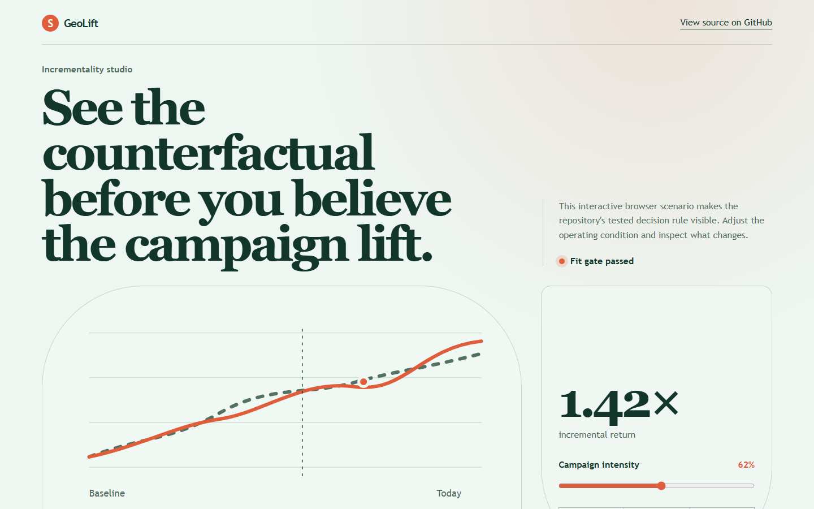
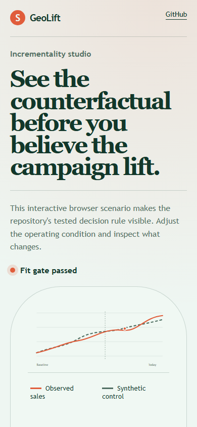

# geolift

> Geo incrementality testing by synthetic control, with a pre-period fit gate and placebo inference - so the lift number survives scrutiny.

## Live deployment

[](https://github.com/SlateGitOrg/geolift/actions/workflows/ci.yml)

[Open the interactive GeoLift demo](https://slategitorg.github.io/geolift/)

The deployed interface uses a deterministic offline scenario to make the repository's tested decision rule visible without external services or private data.

### Desktop



### Mobile



`FLAGSHIP` · **Marketing Analyst** · Expert · ~5-6 weeks · Retail - regional grocery chain

**Primary language:** Python
**Tags:** `causal-inference`, `synthetic-control`, `experimentation`, `incrementality`, `react`

---

## The problem

A brand spends 8M a year on regional media and the platform dashboards report a 6.2x return. When the brand paused spend in two regions as a test, sales did not move. The reported return was measuring people who would have bought anyway - which is the default outcome of every attribution-based measurement, not an unusual failure.

## ⭐ The differentiator

**Augmented synthetic control with a pre-treatment fit gate and placebo inference.** The donor-weighted counterfactual must track the treated region for at least twelve pre-period weeks before any post-period claim is permitted, and significance comes from placebo tests across untreated regions rather than a t-test that assumes independence across time. A generic geo-test compares treated against untreated regions after the fact and attributes an ordinary regional demand difference to the campaign.

This is the sentence to lead with when someone asks you to walk through the
project. Everything else in this repo exists to make it true and to prove it.

## Data

A documented synthetic generator producing regional weekly sales with shared seasonality, region-specific trends and a **known planted lift** - so estimator bias and interval coverage are directly measurable. The real-data path uses public regional series (FRED, ONS regional statistics) for realistic covariance structure.

> No paid API key is required to run or demo this project. Where a paid
> service would add value it is wired as an optional enhancement behind an
> interface with an offline mock as the default implementation.

## Stack

- Python: CVXPY for donor weights, NumPy, pandas
- DuckDB for the panel
- TypeScript / React results dashboard
- Docker, pytest

## Core capabilities

- Test design module: power analysis and treated-region selection given a minimum detectable lift
- Synthetic control fit with donor weights, a pre-period RMSE gate, and covariate matching
- Placebo-based inference producing a p-value and a lift confidence interval
- Holdout-duration and spend-level scenario planner
- Results dashboard showing actual against counterfactual with the pre-period fit visible - the credibility check a reader needs

## Repository layout

```
src/design/
src/scm/
src/inference/
generator/
apps/web/
test/simulation/
```

## Build plan

1. Generator with a planted lift and realistic cross-region covariance. Everything else is scored against it.
2. Synthetic control fit, then the pre-period RMSE gate. The gate is what stops you reporting a lift from a bad fit.
3. Placebo inference. Resist the t-test; it is wrong here and an interviewer will know.
4. Design module and dashboard last - but design matters, because a badly designed test cannot be rescued by analysis.

## Testing strategy

Monte Carlo over 500 simulated experiments asserting **interval coverage**: the 95% interval contains the true planted lift about 95% of the time. Separately assert the estimator is **unbiased under the null** - no false lift when no campaign ran, which is the failure that costs a company real budget.

Tests assert **correctness**, not merely that the code runs. A green suite on
this repo is a claim about behaviour under adversarial conditions; treat any
test that would pass against a deliberately broken implementation as a bug in
the test.

## Quality & safety layer

The pre-period fit gate is enforced in code, not advised in documentation. A fit that fails RMSE cannot produce a published lift estimate.

## Measurable outcome

> True incremental return is 1.4x, not the 6.2x the platform reported - reallocating 3.1M of spend, with a calibrated confidence interval rather than a point estimate.

State it in these terms — business units, not technical ones — in your CV
bullet and in the first thirty seconds of describing the project.

## Interview questions this project answers

- **Why is platform-reported ROAS usually wrong?**
- **How does synthetic control work, and what does it assume?**
- **How do you get a p-value when you have one treated unit?**

## What this deliberately is *not*

- Not an MMM. Geo experiments measure; MMM allocates. They are complementary and this repo says so.
- Not a dashboard - the dashboard exists to make the fit inspectable.


## Run it now

```bash
python -m unittest discover -s tests -v   # the suite
python -m src.demo                        # the 60-second artefact
```

Requires Python 3.11+. The runnable core uses **only the standard
library** (including `sqlite3`), so there is nothing to install.

## Getting started

```bash
git clone <your-fork-url> geolift
cd geolift
pip install -e .
python -m generator --regions 40 --weeks 104 --lift 0.04
python -m src.scm fit --treated R12,R27
python -m src.inference placebo
pytest test/simulation        # coverage + null bias
```

Docker is supported but optional — every path above works on a plain
Windows/macOS/Linux laptop without a cloud account.

## Definition of done

- [ ] The differentiator above is implemented, and a test proves it
- [ ] The measurable outcome is produced by a command anyone can run
- [ ] `README` explains the one decision a generic version gets wrong
- [ ] CI runs the full suite on every push and is green on `main`
- [ ] A recruiter can see the headline artefact in under 60 seconds

## Licence

MIT — see [LICENSE](LICENSE).
